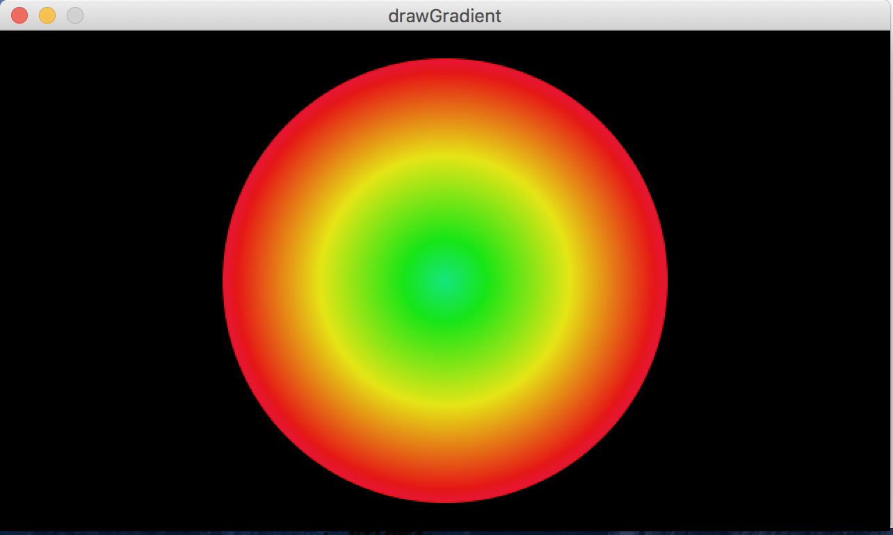
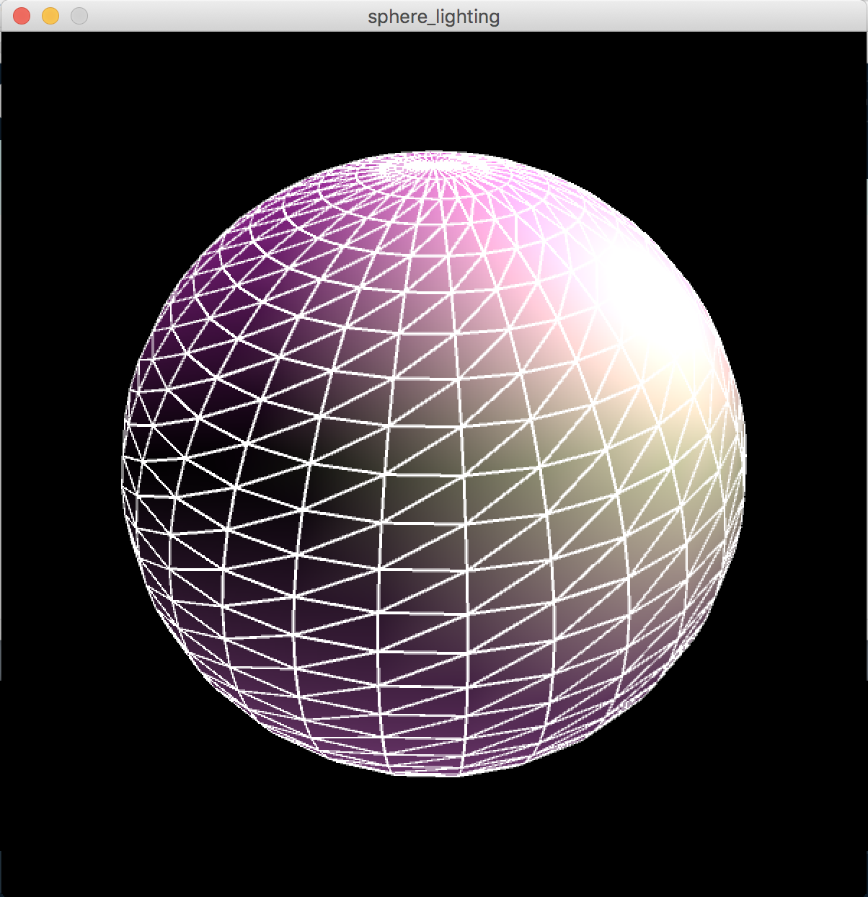

<!--Homework of Creative Programming-->

# 第二次作业说明
## Draw Gradient
### description
A dynamic circle showing the change of color according to the HSB color ring.   

## Sphere Lighting
### description
Create a rotating sphere to imitate the motion of earth with multiple directional and point lights.  
The point light changes according to your mouse position.  
