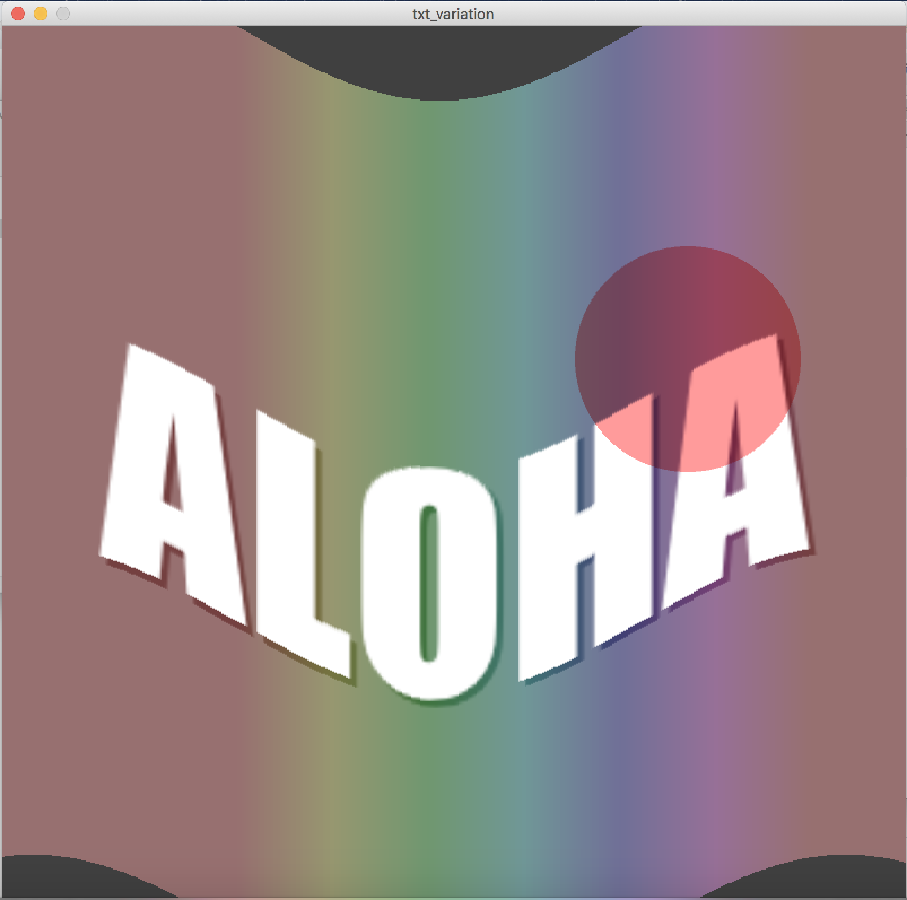

# Homework 4
## Text variation

This work shows the dynamic move and color change of text "aloha" with regard to sin function. 

You can try press the mouse and see the color change!

## Cases

Inside this folder are some interesting cases of visualization works. Please note to check and appreciate~
